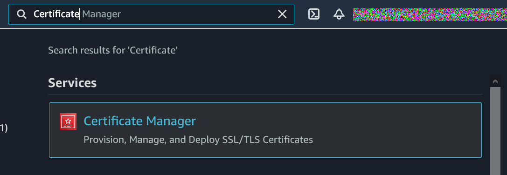
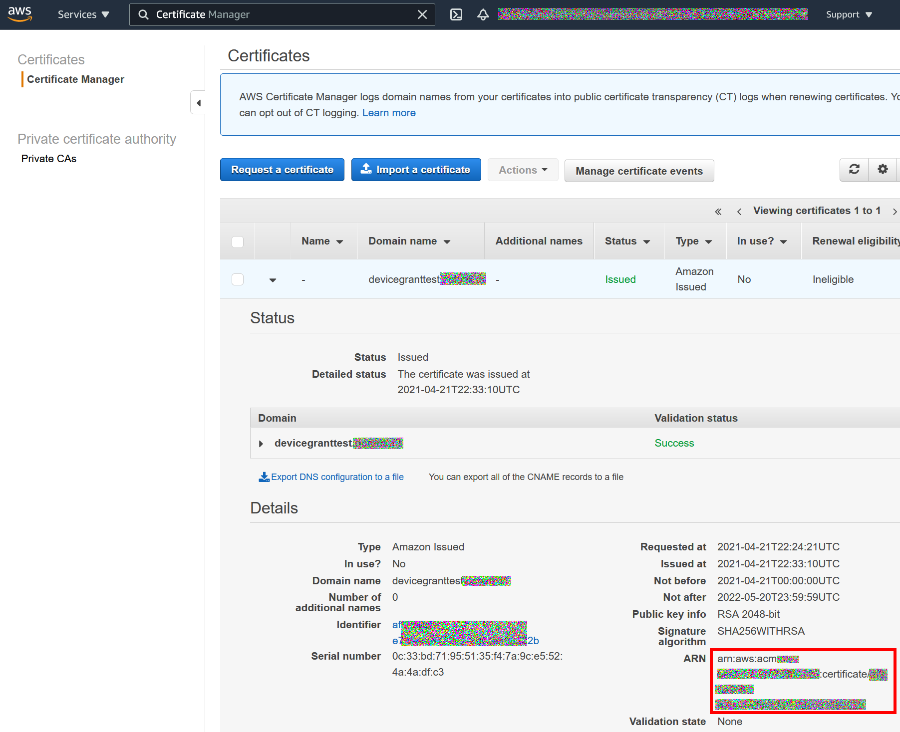
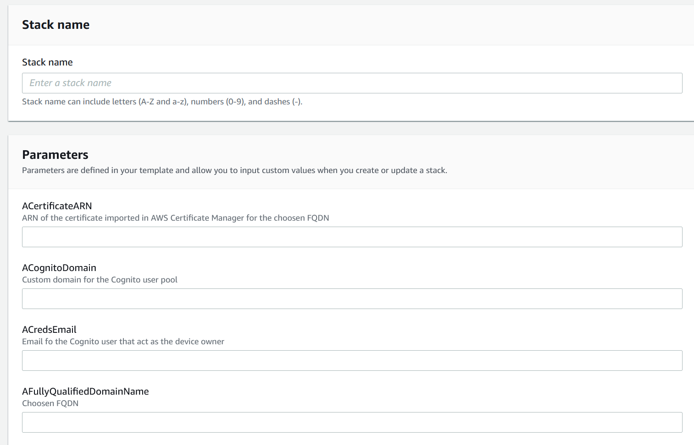
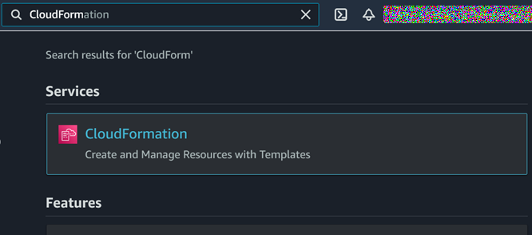
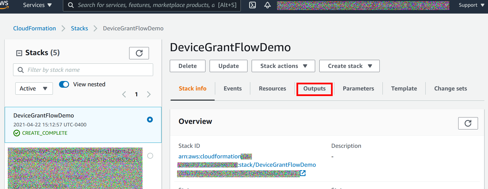

# CloudFormation template deployment
The implementation requires 3 steps:
1.	Defining the public Fully Qualified Domain Name for AWS ALB public endpoint and obtaining a X.509 associated to it
2.	Deploying the provided AWS CloudFormation Template
3.	Configuring the DNS to point to the AWS ALB public endpoint for the public Fully Qualified Domain Name

## Choosing a DNS name and storing certificate for it in AWS certificate Manager
Your Lambda function endpoints will need to be publicly resolvable when exposed by AWS ALB through a HTTPS/443 Listener. In order to be able to configure the AWS ALB component:
 - Choose a Fully Qualified DNS Name in a DNS zone you own;
 - Generate the associated X.509 certificate and private key:
  - Directly within AWS Certificate Manager;
  - Alternatively, at least, imported them in AWS Certificate Manager.
- Copy the ARN of this certificate in AWS Certificate Manager.
For more information on “How to request a public certificate”, please refer to the [guide for AWS Certificate Manager](https://docs.aws.amazon.com/acm/latest/userguide/gs-acm-request-public.html).

Once imported in ACM:
1.	From the ACM console: 

2. Click on the ► icon next to your certificate:

![Locating Certificate]../img/ACM-Locating-certificate.png)

3. Copy the associated ARN in a text file:

## Deploying the solution using a CloudFormation Template
To configure the workshop you will need to deploy the master workshop template.
> Before you deploy the CloudFormation template feel free to view it [here](../CFT/CFT-DeviceGrantFlowDemo-latest.yml)

It is best to deploy in `us-east-1` using Cloud Formation.

During the configuration, you will be asked to:
- Provide a name for the stack
- Provide the ARN of the certificate created/imported in AWS Certificate Manager at the previous step
- Provide a valid email address you own for the Cognito User’s initial password to be sent to you;
- Provide the FQDN you choose and that is associated to the certificate created/imported in AWS Certificate Manager at the previous step

- Once configured, click on “Next” two times. Finally, on the “Review” page tick the box that authorizes CloudFormation to create IAM resources for the stack:

- Deploy the stack by clicking on “Create stack”.
- The Deployment of the CloudFormation stack will take several minutes. Wait for the result to be “CREATE_COMPLETE”.

## Finalizing the configuration
Once everything is set up, you have to finalize the configuration by ensuring the DNS name for the zone your own is pointing to the ALB DNS by creating an appropriate CNAME entry in your DNS system of choice.

1. From the CloudFormation console:

2. Locate your stack and click on it:

3. Click on the Outputs tab:

4. Copy the value for the Key ALBCNAMEForDNSConfiguration:

5. Configure a CNAME DNS entry into your DNS Hosted zone based on this value:

> For more information on how to create a CNAME entry to AWS ALB in DNS a DNS zone, please refer to the [guide for Amazon Route 53](https://docs.aws.amazon.com/Route53/latest/DeveloperGuide/resource-record-sets-creating.html).

6. Please note the other values in the Output tab, they will serve you for the next section:

| Output parameter | Usage |
| ---- | ---- |
| DeviceCognitoClientClientID | App Client ID to be use by the simulated Device to interact with the authorization server |
| DeviceCognitoClientClientSecret | App Client Secret to be use by simulated Device to interact with the authorization server |
| TestEndPointForDevice | HTTPS Endpoint for the simulated DEVICE to make their requests |
| TestEndPointForUser | HTTPS Endpoint for the USER to make their requests |
| UserPassword | Password for the Test Cognito User |
| UserUserName | Username for the Test Cognito User |